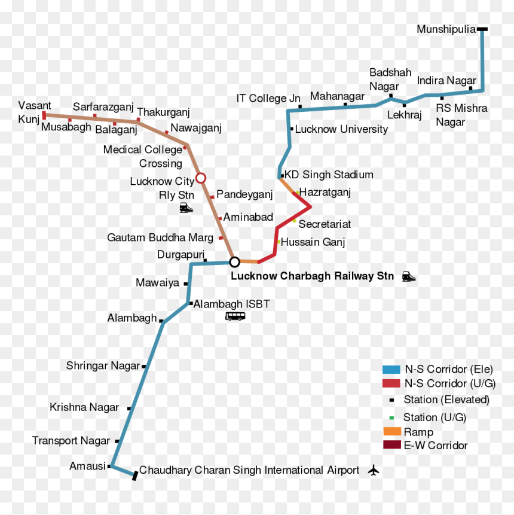

# Lucknow Dijkstra

Lucknow Metro Route Calculator using Dijkstra's Algorithm. This Java program calculates the shortest path between metro stations in Lucknow using Dijkstra's algorithm. It includes predefined station data with coordinates and distances, allowing users to find the shortest route between any two stations.

## Features

- **Shortest Path Calculation:** Uses Dijkstra's algorithm to compute the shortest path from a selected source station to all other stations.
- **Interactive Input:** Allows users to input any two station numbers and calculates the shortest distance between them.
- **Station Information:** Provides station names, numbers, and coordinates for reference.

## Lucknow Metro Route Map

**Map 1:**

.svg.png)

**Map 2:**

## Station Information

| Station Number | Station Name             | Coordinates          |
|----------------|--------------------------|----------------------|
| 1              | Munshipulia              | 26.887856°N 80.995842°E |
| 2              | Indira Nagar             | 26.872622°N 80.990818°E |
| 3              | Bhootnath Market         | 26.872162°N 80.982272°E |
| 4              | Lekhraj Market           | 26.870861°N 80.973554°E |
| 5              | Badhshah Nagar           | 26.870631°N 80.961702°E |
| 6              | IT Chauraha              | 26.870937°N 80.945578°E |
| 7              | Vishwavidyalay           | 26.865501°N 80.939566°E |
| 8              | KD Singh Stadium         | 26.8539°N 80.9367°E     |
| 9              | Hazrat Ganj              | 26.850723°N 80.940425°E |
| 10             | Sachvalaya               | 26.842376°N 80.941155°E |
| 11             | Hussein Ganj             | 26.839082°N 80.934498°E |
| 12             | Charbagh                 | 26.832343°N 80.922989°E |
| 13             | Durgapuri                | 26.831960°N 80.915431°E |
| 14             | Mawaiya                  | 26.825143°N 80.909849°E |
| 15             | Alambagh Bus Station     | 26.818403°N 80.907272°E |
| 16             | Alambagh                 | 26.813960°N 80.902462°E |
| 17             | Singar Nagar             | 26.803044°N 80.896311°E |
| 18             | Krishna Nagar            | 26.794386°N 80.891721°E |
| 19             | Transport Nagar          | 26.777836°N 80.882574°E |
| 20             | Amausi                   | 26.771246°N 80.878623°E |
| 21             | CCS Airport              | 26.766150°N 80.883561°E |

## Usage

1. **Running the Program:**
   - Compile the Java files.
   - Run the `LucknowDijkstra` class which prompts for station numbers and displays shortest paths.

2. **Input Format:**
   - Enter the station numbers as prompted to calculate shortest paths.
   - Example: Enter `1` for Munshipulia and `10` for Sachvalaya.

3. **Contributing:**
   - Contributions are welcome! Fork the repository, make changes, and submit pull requests.

Feel free to reach out if you have any questions or suggestions! Happy navigating the Lucknow Metro routes!
